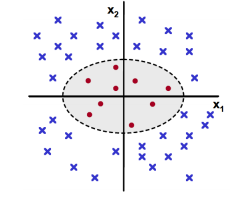
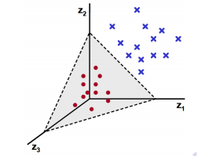

## 1. Classification vs Regression

This is a classification problem. Because we are given the student's data and its attribute and we have to classify that whether a particular student is in need of intervention or not. When we classify an example based on its given attributes and by learning from the training data, it is an example of classification problem.  
It would have been an example of regression if we had to find some continuous value based on the attribute of the data. For example, in Boston Housing prices data set, we were given the attributes of each locality and we had to predict the price of a house in that particular locality. So the model which produces a continuous value as output is a regression model while the one which produces a discrete output is classification problem.

## 2. Exploring the data

Total number of students: 395  
Number of students who passed: 265  
Number of students who failed: 130  
Number of features: 31  
Graduation rate of the class: 67.09%  

## 3. Preparing the Data

### Feature column
Feature column(s):-  
['school', 'sex', 'age', 'address', 'famsize', 'Pstatus', 'Medu', 'Fedu', 'Mjob', 'Fjob', 'reason', 'guardian', 'traveltime', 'studytime', 'failures', 'schoolsup', 'famsup', 'paid', 'activities', 'nursery', 'higher', 'internet', 'romantic', 'famrel', 'freetime', 'goout', 'Dalc', 'Walc', 'health', 'absences']  
**Target column**: passed

### Preprocess feature columns
Processed feature columns (48):-  
['school_GP', 'school_MS', 'sex_F', 'sex_M', 'age', 'address_R', 'address_U', 'famsize_GT3', 'famsize_LE3', 'Pstatus_A', 'Pstatus_T', 'Medu', 'Fedu', 'Mjob_at_home', 'Mjob_health', 'Mjob_other', 'Mjob_services', 'Mjob_teacher', 'Fjob_at_home', 'Fjob_health', 'Fjob_other', 'Fjob_services', 'Fjob_teacher', 'reason_course', 'reason_home', 'reason_other', 'reason_reputation', 'guardian_father', 'guardian_mother', 'guardian_other', 'traveltime', 'studytime', 'failures', 'schoolsup', 'famsup', 'paid', 'activities', 'nursery', 'higher', 'internet', 'romantic', 'famrel', 'freetime', 'goout', 'Dalc', 'Walc', 'health', 'absences']

### Split data into training and test set
Training set: 296 samples  
Test set: 99 samples


## 4. Training and Evaluating Models  
I choose the following three supervised learning models for this dataset  
1. Support Vector Machines  
2. Gaussian Naive Bayes  
3. Random Forest Classifier 

Let's go over them one by one

### Support Vector Machines
**Applications of SVM**
- It has been used in personalized and centered learning. There are a large number of AI techniques to tailor the content to the learner depending on his context.SVMs stand out due to their better performance specially in handling large dimensions which text content do possess.
- Clustering is an important task for image compression. This clustering can be done by an SVM efficiently. 
- SVM has been used  to classify different land covers using remote sensing data. Results have also suggested  that Multi-class SVMs perform well in comparison with neural network and decision tree classifiers.
- SVMs have also been used in handwritten digit recognition.
 
**Advantages of SVM**
- SVMs do a great job in formulating non-linear decision boundaries. Other supervised learning methods like Decision Trees and Logistic regression won't give optimized results when the data is randomly distributed and there is no clear linear separation between them.
-  By introducing the kernel, SVMs gain flexibility in the choice of the form of the threshold separating the different types of data. We can also write our custom kernels to specify the similarity between the data. This feature of writing custom kernels makes it very versatile.
-  The SVM is an effective tool in high-dimensional spaces, which is particularly applicable to document classification and sentiment analysis where the dimensionality can be extremely large (≥10^6).


**Disadvantages of SVM**
- SVMs don't work well with large datasets because the time complexity of training them is of the order of O(N^3).From a practical point of view this is the most serious problem of the SVMs is the high algorithmic complexity and extensive memory requirements of the required quadratic programming in large-scale tasks.
- Also they don't work when the data contains a lot of noise and the classes are overlapping to each other.
- In situations where the number of features for each object exceeds the number of training data samples, SVMs can perform poorly. This can be seen intuitively, as if the high-dimensional feature space is much larger than the samples, then there are less effective support vectors on which to support the optimal linear hyperplanes.


**Why chose this model?**  
First of all, the number of rows in the data is only 296. So as SVMs perform very well in small size datasets, that's why SVMs make a good fit here. Also, as in most real-world scenarios, the decision boundaries are not linear and SVMs have an advantage on the place where the data is randomly distributed and the decision boundary is not-linear.

**Measurements from SVM**

| Training size       | Training time (s)      | Prediction time (s)  | Training F1   | Test F1   |
| -------------       |:-------------:         | -----:               | ------:       | ------:   |
| 100                 | 0.002                  | 0.001                |  0.846        | 0.844     |
| 200                 | 0.004                  | 0.003                |  0.856        | 0.842     |
| 296                 | 0.007                  | 0.007                |  0.868        | 0.842     |

### Gaussian Naive Bayes  
**Applications of SVM**
- A major use of Naive Bayes is in Document Classification.It remains a popular (baseline) method for text categorization.
- Another common application is Spam filtering i.e making incoming emails as spam based on the contents of the mail.
- It also finds application in automatic medical diagnosis i.e calculating the probability that a person has a disease or not.
- It's used in credit approval systems where we determine whether a person should be issued a credit card on not based on the attributes(household income, education etc) of that person. 
- It's used in building Recommender system that predicts whether the user will like a given resource. It has countless uses in the social networks like Facebook and other sites like Netflix and Airbnb.


**Advantages of Naive Bayes**  
- A very big advantage is that they require a small amount of training data to estimate the necessary parameters.
- Naive Bayes learners and classifiers can be extremely fast compared to more sophisticated methods.The decoupling of the class conditional feature distributions means that each distribution can be independently estimated as a one dimensional distribution. This in turn helps to alleviate problems stemming from the curse of dimensionality.
- Naive Bayes classifiers are highly scalable, requiring a number of parameters linear in the number of variables (features/predictors) in a learning problem.

**Disadvantages of Naive Bayes**  
- When the data has lot of dependent attributes it will actually perform poorly because of its apparently over-simplified assumptions regarding conditional independence.
- Although naive Bayes is known as a decent classifier, it is known to be a bad estimator, so the probability outputs are not to be taken too seriously.
- It has a very simple representation and doesn't allow for rich hypotheses.


**Why chose this model?** 
Naive Bayes classifier is always a good bet if we want something fast and easy that performs pretty well. Also it will perform better if the assumption of conditional independence actually holds true between the attributes. In the given data, as i can see that there is a little dependence between attributes like `health` and `absences` etc.So there can be a slight dip in its performance. But overall,it will perform pretty well.


**Measurements from Gaussian NB**  

| Training size       | Training time (s)      | Prediction time (s)  | Training F1   | Test F1   |
| -------------       |:-------------:         | -----:               | ------:       | ------:   |
| 100                 | 0.002                  | 0.001                |  0.845        | 0.707     |
| 200                 | 0.001                  | 0.001                |  0.756        | 0.742     |
| 296                 | 0.001                  | 0.001                |  0.821        | 0.748     |


### Random Forest Classifier
**Applications of Random Forest Classifier**  

- Its used in the stock market business,where many factors weigh in to determine whether a given stock will go up or down on any given day. Binomial Option Pricing models use it.
- Random Forests have been applied to the task of distinguishing between stars and cosmic rays in images collected by the Hubble Space Telescope.Each of the images were described using 20 numerical features and labeled as either a star or a cosmic ray and the classifier was able to achieve a generalization accuracy of over 95%.
- It can be used as an "instant physician".A RF can be trained with a large number of medical records, containing various diseases and its symptoms. After training, it can be presented with input consisting of a set of symptoms and the tree will determine whether the given symptoms evaluate to a disease.


**Advantages of Random Forest Classifier**  
- Random forest runtimes are quite fast, and they are able to deal with unbalanced and missing data
- Random decision forests specially correct for decision trees' habit of overfitting to their training set.
- The ability of automatically producing accuracy and variable importance and information about outliers makes random forests easier to use effectively.
- The other main advantage is that, because of how they are constructed (using bagging or boosting) these algorithms handle very well high dimensional spaces as well as large number of training examples.
- Random forests is not very sensitive to the parameters used to run it.


**Disadvantages of Random Forest Classifier**  
- When used for regression they cannot predict beyond the range in the training data, and that they may over-fit data sets that are particularly noisy.
- Another issue related to regression is that random forests tends to overestimate the low values and underestimate the high values. This is because the response from random forests in the case of regression is the average (mean) of all of the trees.
- A large number of trees in Random Forest may make the algorithm slow for real-time prediction.

**Why chose this model?**  
Here i believe the Random Forest will prove really good in classifying because it's one of the Ensemble Learning methods.One common problem of Decision Trees is that even small variations in the data can altogether alter the generated tree but when we use Ensemble methods,they average the results of different Decision Trees, so there wont be much fluctuation in the results.  
Decision Trees in general perform well on classification problems when the data set is not huge, and Random Forests overcome all the negative points that a Decision Tree have and are able to generalize the data well thus avoiding overfitting.


**Measurements from Random Forest Classifier**  

| Training size       | Training time (s)      | Prediction time (s)  | Training F1   | Test F1   |
| -------------       |:-------------:         | -----:               | ------:       | ------:   |
| 100                 | 0.033                  | 0.001                |  1.0          | 0.732     |
| 200                 | 0.028                  | 0.002                |  0.996        | 0.748     |
| 296                 | 0.030                  | 0.003                |  0.992        | 0.768     |


## 5. Choosing the best model 

### Which is the best model?

I think SVM is the best model for classifying the given data. The reasons for the same are as follows

- Among the three models, one model that is not at all performing well with this data is Gaussian NB classifier. Its F1 score for both the training and testing sets specially is quite low compared to the other two classifiers.For training size of 296, it has a F1 score of .748 and so the training set is also performing not that well in this case. Naive Bayes performs poorly i think because of the over simplified assumptions it makes. It never takes into consideration the effect of two attributes combined in the probability calculations. For example, in the data, the attributes `health` and `absences` are not independent of each other. Actually the attribute `absences`(the number of absences a student has taken) is dependent on the attribute `health`(health of the student) and both of these can affect the result collectively. Again the attributes `traveltime`(time taken to travel to and from from school) is not independent of `studytime` ( the weekly time available for study). Also Naive Bayes doesn't accept any parameters in its function which can be tuned to improve its F1 score.

- Now comes the Forest Classifier and SVM. Among these models, Random Forest has an extremely high F1 score for all three sets of training data. An F1 score too high (arround 99.2% and even 100%)is a clear sign of overfitting and looks like it has not been able to generalize well over the data.
- The time complexity of training an SVM is of the order of O(N^3) while for a Random Forest, it is O(M(mn log n) where n is the number of  instances and m is the number of attributes, and M is the number of trees. However, for this small amount of data, SVM still performs 5 times better in terms of training time. 

- Although the prediction time of training set in case of Random Forest is comparatively less than that of SVM, but in case of prediction time of test sets, its almost equal for both of them (0.002 s).

So based on the limited amount of data we have(~300) and by observing the time complexity of these models, we can safely choose SVM for this purpose. In case of RFC, i think it needs more fine tuning of its parameters(like number of estimators and max-depth of the tree) to overcome the problem of overfitting here. And surely if the data size is very large, it can outperform SVM in terms of time complexity.


### How does an SVM work?

An SVM is just a simple linear separator. It separates two classes by drawing a line between them. In layman's terms, it involves finding the hyperplane (line in 2D, plane in 3D and hyperplane in higher dimensions. More formally, a hyperplane is n-1 dimensional subspace of an n-dimensional space) that best separates two classes of points with the maximum margin.

&nbsp; &nbsp; &nbsp; &nbsp; &nbsp; &nbsp; &nbsp; &nbsp; &nbsp; &nbsp; &nbsp;&nbsp; &nbsp; &nbsp; &nbsp; &nbsp; &nbsp; &nbsp; &nbsp; &nbsp; &nbsp; &nbsp;&nbsp; &nbsp; &nbsp; &nbsp; &nbsp; &nbsp; &nbsp; &nbsp; &nbsp;

In the above diagram(**image credit-Quora**), there are two types of classes present represented as black and white circles. Now there are an infinite number of lines that can be drawn in the diagram to separate the black and white circles. But SVM chooses the line that maximizes the distance between two points that are closest and belong to opposite classes.In the figure, that line is the middle one.

The closest points of which it is trying to maximize the distance are called as  the "support vectors" (the name "support vector machine" is due to the fact that points are like vectors and that the best line "depends on" or is "supported by" the closest points).In the above diagram,the points from which the lines `wx-b=1` and `wx-b=-1` passes are support vectors.The connecting lines between the closest points is drawn by doing vector subtraction (point A - point B,where A and B are support vectors). Now the best separating line is the line that bisects and is perpendicular to the connecting line.

Now, when there is no clear linear separation between the data as in the below image(**credit-CS Utah slides**), then we have to adopt a method known as Kernel Trick. So in the left image each point is defined by two features `(x1,x2)`. Now we map each point `(x1,x2)` as `Z=(x1^2,sqrt(2)x1*x2,x2^2)`. If we map each point using the newly created three features, the data becomes linearly separable as shown in the right image.

&nbsp; &nbsp; &nbsp; &nbsp; &nbsp; &nbsp; &nbsp; &nbsp; &nbsp; &nbsp;&nbsp; &nbsp; &nbsp; &nbsp; &nbsp; &nbsp; &nbsp; &nbsp; &nbsp;&nbsp; &nbsp; &nbsp; &nbsp; &nbsp; &nbsp; &nbsp; &nbsp; &nbsp; &nbsp;&nbsp; &nbsp;

The job of classifying the data into different data sets is given to the Kernel Function. It is the Kernel function that takes into input two data points and emits out the similarity between those points. Two common kernels used in SVMs are Linear kernels and Radial Basis Function(RBF) kernel.

### Fine tuning of the classifier
```
# TODO: Fine-tune your model and report the best F1 score
from sklearn import grid_search
from sklearn.metrics import f1_score

clf = svm.SVC()
param_grid = [
  {'C': [1, 10, 50, 100, 200, 250, 300, 350, 400, 500, 600],
   'kernel':['rbf','poly','sigmoid'],
   'gamma': [1,0.1,0.01,0.001,0.0001,0.00001,0.000001,0.0000001],
    'tol':[1,0.1,0.01,0.001,0.0001,0.00001,0.0000001]
  }
 ]

regressor = grid_search.GridSearchCV(clf, param_grid, cv=5,scoring='f1_weighted')
regressor.fit(X_train, y_train)
reg = regressor.best_estimator_
print reg
train_predict(reg, X_train, y_train,X_test,y_test)
```

I have supplied different parameters of an SVM to `GridSearchCV` that searches effectively for the best combination of parameters. The best model produced from the above `GridSearchCV` is
```
SVC(C=200, cache_size=200, class_weight=None, coef0=0.0,
  decision_function_shape=None, degree=3, gamma=0.001, kernel='rbf',
  max_iter=-1, probability=False, random_state=None, shrinking=True,
  tol=0.001, verbose=False)
  ```

### Model's final F1 score.
The classifier's final F1 score for the training set came out to be 0.886836027714
